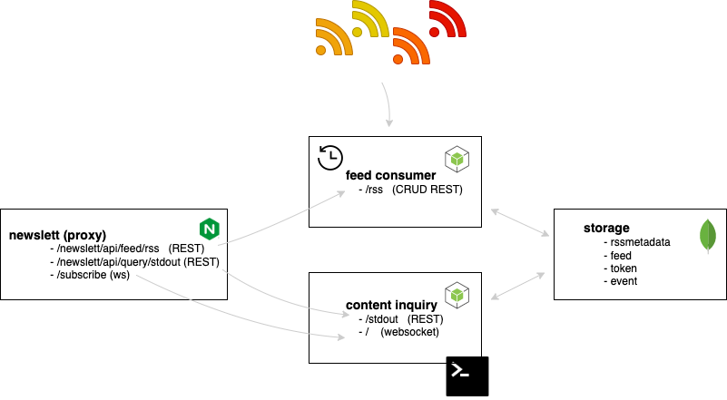

# Newslett 


## Architecture and information flow (as-is)


  


In the diagram above are 4 main components:

- **storage** -> mongodb that has 4 collections:
  - **rssmetadata** -> stores basic information about each RSS feed. Some of the information are `name`, `rssUrl`, `contentLocation`, `contentDomSelector`, etc. More about these properties in Feed Consumer description section.
  - **feed** -> every time new feed (single blog) is found, its `guid` and `link` are stored in this collection. It avoids redudant work if the feed is already processed. To enable fast searching, collection should be indexed using `guid` field.
  - **token** -> this collection is populated using `feed consumer` app and then consumed from `content inquiry` during query processing. The structure of this collection is `token -> list of guid`, or for example `eth -> 4,3,52` which means that `eth` is present in articles with `guid = 4`, `guid = 3` and `guid = 52`. Such a structure is actually **inverted index** that will alow fast search.
  - **event** -> in reality, this collection should not exist. It would be replaced with some messaging system (kafka, rabbitmq, ...) Here, it is used for communication indirect between `feed consumer` and `content inquiry`. More about this in diagrams below.
  
- **feed consumer** -> there are two main roles:
  - **API** that manages RSS metadata. It can create/update/delete/list RSS metadata. 
  - **Cronjob** that executes every minute (configurable via cron expresion). This Job fetches RSS feeds and store tokens (as inverted index) in the `token` collection. Also, it publishes event (via `event` collection) that new feed is arived.

- **content inquiry** -> this app is here to provide feeds (blogs) that match the search criteria. There are two ways to submit the search query. In any case, the app will return immediately all previosly found blogs (from mongodb). Also, this app listens for `event` collection changes, and if something new arrives, it checks agains submited queries and shows in correspondig channels:
  - **/stdout api** -> once the query is submitted via api, the result is printed in console. 
  - **websocket** -> connected websocket clients can send the search query and matched results will be returned to them. There can be multiple ws clients.

- **newslett (proxy)** -> nginx proxy that sits in front of these apps, so single endpoint (localhost:3003) is used for connections. Request mapping is like in the diagram.


<br>
<br>

## Feed Consumer

The pseudocode below represents the main logic in `feed consumer` app. This logic is part of the cronjob and it is execute every minute. 
```
cron job started
list<rss_metadata> = fetch from mongodb.rssmetadata
for each rss_metadata in list<rss_metadata>:
    rss_xml = http_get_request(rss_metadata.rss_url)    // polling
    items = rss_xml.items
    foreach item in items:
        guid = item.guid
        if (guid exists in mongodb.feed)
            continue
        link = item.link
        blog_html = http_get_request(item.link)
        content = parse_blog_using_dom_selector(blog_html, metadata.content_dom_selector)   
                                        // blog_html = '<p>This is <b>text</b></p>'
                                        // content_dom_selector = 'p'
                                        // content = 'This is text'

        tokens = tokenize_and_stem(content)     // we don't store the word as-is, but find the root 
                                                // of the words and store it instead
                                                // [fishing, fishes, fisher] --> fish
        foreach token in tokens:
            update mongodb.token with (token -> guid) // single token has multiple guids (list)
        
        store (guid,link) into mongodb.feed
        store (guid, tokens) into mongodb.event
```
The execution/logic is imagined to be quite agnostic and dependent on parameters in `rss_metadata`. 
The assumption is that the blogs will can be fetched as html files and then the good 
enough `content_dom_selector` will give the flexibility to find the text/content.

Other parameters that are relevant inside `rss_metadata`.
- `rss_url` -> url of the rss feed. return rss xml
- `content_location` -> sometimes it is inside rss feed and then its value is `CONTENT_ENCODED` (\<content:encoded> tag). Otherwise it 
can be `GUID` which requires additional http call
- `content_dom_selector` -> like a jquery selector. for example `$('.text-body).text()` returns all the text inside `.text-body` class.
- `external_link` -> which field inside \<item> contains full link to the blog. Can be `LINK` or `GUID`

The complete list with all parameters for rss feeds mentioned in the challenge is:

 rss_url                           | content_location       |  content_dom_selector                                             | external_link  |
|----------------------------------|------------------------|-------------------------------------------------------------------|----------------|
| https://decrypt.co/feed          | GUID                   | .text-body                                                        |LINK            |
| https://blockworks.co/feed/      | CONTENT_ENCODED        | *                                                                 |LINK            |
| https://cryptopotato.com/feed    | CONTENT_ENCODED        | p                                                                 |LINK            |
| https://cryptobriefing.com/feed/ | GUID                   | .article-content p :not(.disclaimer-content)                      |LINK            |
| https://dailyhodl.com/feed/      | CONTENT_ENCODED        | p                                                                 |LINK           |
| https://cointelegraph.com/rss    | GUID                   | .content-inner p, .post-content p, .explained-post-content p      |GUID           |


> **Why does the solution poll RSS feeds? Is there a better way?** <br>
> Some of the feeds support publish/subscribe protocols (*pubsubhubbub*) and in reallity we could use them to get notified once the new blog is published.
> They are implemented as webhooks, and this is the reason why I decided not to use them. I  would need
> to provide the 'Callback URL' that will be hit with the new blog and it will not work on the laptops that are behind NAT routers.<br>
> I could use the tunnel with public endpoint on one side, but all free tunnel services are quite unstable with unpredictable latency.


<br><br>


## Content Inquiry

Again, the pseudocode explains the main processes inside `content-inquiry`.

```
// HTTP POST /newslett/api/query/stdout 
function submit_query_stdout(query_text):
    links = evaluate(query_text)         // take a look at `query` module/package
                                         // this is adapted shunting yard algorithm
    foreach link in links:
        print(link)
    subscribe(query, stdout)

// WEBSOCKET /newslett/api/query/subscribe
function submit_query_websocket(query_text):
    links = evaluate(query_text)
    foreach link in links:
        ws.send(link)
    subscribe(query_text, ws)


subscriptions[]
function subscribe(query_text, channel):
    subscriptions.add( {query_text, channel}  )

// executed on startup
mongodb.event.onchange(event):
    guid = event.guid
    tokens = event.tokens

    foreach sub in subscriptions:
        query_text = sub.query_text
        yes_no = evaluate_single(query_text, tokens)    // no need to go to mongodb again
                                                        // all tokens belong to single guid
        if yes_no == 'yes' then:
            channel = sub.channel
            link = find in mongodb.feed for guid
            execute channel with link                   // channel can be print or ws.send                               
```
> **Format of the 'query_text'**<br>
> Special characters are `( `,  `) `,  `AND ` and  `OR`<br>
> Valid examples are: <br>
> - `eth AND bitcoin` <br>
> - `(eth AND ( btc OR home )) OR nft` <br>
> 
> In general, any expression that satisfies brackets rules (opened bracket has to be closed) is considered as valid. Also, keywords `AND` and `OR` are 
> binary operators, so there has to be token (or brackets) on each side.<br><br>
> *I am aware that I don't perform specific validations in controllers (or middlewares). So malfored query text can be submitted, 
> and user will not see something like '400 Bad Request'. Instead, the exception would be thrown during excution.*  

<br><br>

## Testing

Prerequisites:
- `docker`
- `docker-compose` (not experimental `docker compose`)
- free ports 3001, 3002, 3003. 27017 (if not possible to free them, reconfiguration is needed)
- `curl`

Enter the root directory and execute
```
sh ./start.sh
```
This command will create docker network (type bridge), start mongodb as docker container and start three containers that are
part of `docker-compose.yml` file. After that, it will excute `curl` command to insert single rss metadata (*decrypt* feed).
Finally, this script will tail the logs from `content-inguiry` application. These logs show
the results of queries received through `http://localhost:3003/newslett/api/query/stdout`.

<br>

### Create rss metadata

To create new rss metadata, execute some of the commands below (or create your own following the rules described in Feed Consumer section):
```bash
curl --location --request POST 'localhost:3003/newslett/api/feed/rss' \
--header 'Content-Type: application/json' \
--data-raw '{
    "rssUrl":"https://blockworks.co/feed/",
    "name":"blockworks",
    "contentLocation":"CONTENT_ENCODED",
    "contentDomSelector":"*",
    "externalLink":"LINK"
}'
```
```bash
curl --location --request POST 'localhost:3003/newslett/api/feed/rss' \
--header 'Content-Type: application/json' \
--data-raw '{
    "rssUrl":"https://cryptopotato.com/feed",
    "name":"cryptopotato",
    "contentLocation":"CONTENT_ENCODED",
    "contentDomSelector":"p",
    "externalLink":"LINK"
}'
```
<br>

### Rest (stdout) query

```bash
curl --location --request POST 'http://localhost:3003/newslett/api/query/stdout' \
--header 'Content-Type: application/json' \
--data-raw '{
    "text":"eth OR bitcoin"
}'
```
You could replace text propery with your own query phrase. Once you submit the the request, you will notice
that new logs will be shown in the console from `content-inquiry`. The logs show only the latest submitted (search) query, so the console output changes with every stdout query.

<br>

### WebSocket query

Multiple clients can connect via websocket using the endpoint `http://localhost:3003/subscribe`. Once connected,
clients will see the *welcome* message. Every time they send the query to the server, the server will respond
with feeds from the database and continue with streaming the feeds that match the criteria and are discovered/created
after webocket connection.

I have tested this feature with chrome extension `Simple WebSocket Client` because it offers "message log", and doesn't show only the latest message.

SLIKAA


